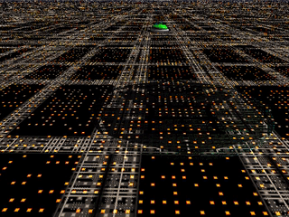
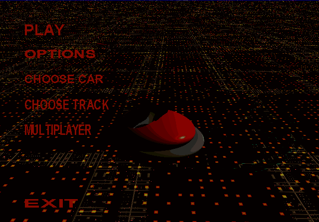
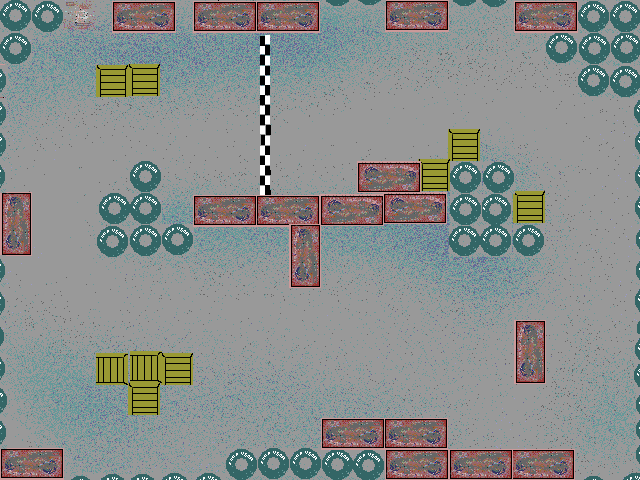
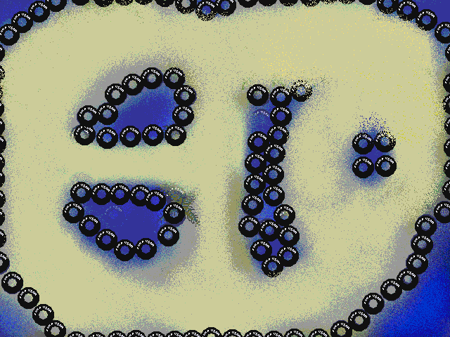
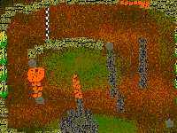
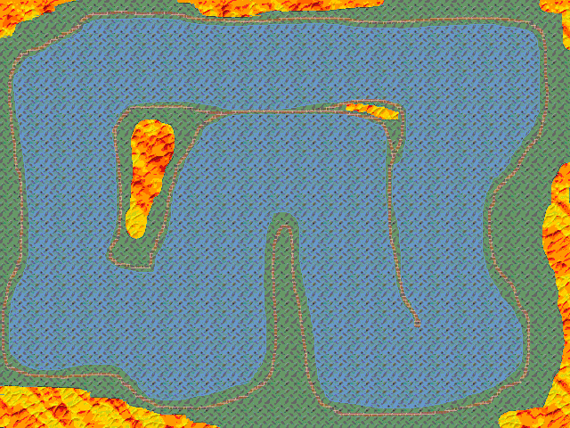
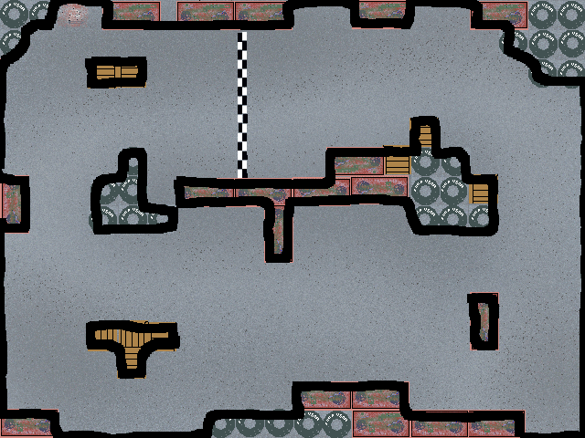

# Bumper Cars!

Bumper Cars is a 2D video game where you use your keyboard to control a bumper car with the intent to be the first to perform three laps around a track or capture a flag three times, depending on the map.  It has multiplayer support for both local and remote players (up to 4) because it just would not be fun to be the only person driving a bumper car.

My friend Chris and I did this for our college senior project in 2001.  It was written in C++ and Visual Basic, targeted for the Windows platform and leveraged DirectX 6.

# Game Play

When a player starts the game, they are given a menu with some options to configure their experience.  

They are able to choose their car color, the track (we had many! oooh!) and whether or not they wanted to play against other players.  We did not have any AI players so if you chose not to play against anyone you were on a track by yourself.  Guaranteed winner!

The multiplayer logic would essentially create or join a game play session with other people. Once sessions were created, colors chosen (with a very nifty 3D car selection screen if I do say so myself), and map chosen, the map track would display with all participating players line up and the countdown to start would begin.

Using only UP, DOWN, LEFT and RIGHT keys, players would try to race around the track avoiding both each other and obstacles.  Upon hitting any player or part of the track boundaries/obstacles, the players cars would bounce back and cause them to slow down considerably.  If you bumped into something too many times, your car would eventually explode and you would respawn at the starting line.  

There were periodic "power ups" that appeared on the maps from time to time.  It was either dynamite or a health kit.  Hitting dynamite would not bump you backward but would increase  your car damage. Hitting the healthkit would reverse your damage and make you more durable.
Too many dynamites and.. you would explode.  Really, what do you expect driving over lit dynamite?

# Goal

There were two styles of play depending on the map.  The maps with the checkered lines were for racing around and completing three laps to win.  Maps without the lines were a 'capture the flag' type scenario.  A flag would randomly spawn on the map and players would race to be the first one to drive over it.  Three captures and you win.

# Maps

We had a bunch of cool maps.  We had the classic asphalt map where you race around a junk yard:

We had a sandy beach that I now realize looks like a weird face:

We even had a Thanksgiving themed map because this was written in the fall of 2000:

And finally a molten metal map because I had a lot of nifty textures to use in Photoshop.

# Collisions

To set the boundaries and have the cars collide with stuff, each car and map had a 'mask' that we loaded behind the scenes. Basically I masked (ie: 'drew a black line on') everything that I wanted the cars to collide with. As each car's position updated, I would check if any portions of the car mask and map mask had overlapped and if so, raise a collision event on that car or cars.

# Graphics

Most of the graphics were created by us using either Photoshop or Bryce 3D.  Art is a necessary evil in small game development and we tried our best.

# Building The Game

Unfortunately I doubt this project is in a very buildable state.  I did not try before posting everything since that was not my purpose.  I put this code up to preserve it and provide a starting point for anyone that wanted to try building or learning about DirectX/DirectPlay techniques from the days of yore.  I did include an executable in case anyone wanted to try their luck.  Not sure it will run since we built it for Windows XP!
